# 💼 Dashboard App (Flutter + Firebase + Riverpod)

A Flutter-based dashboard to view and manage bills, product list across multiple branches in real-time, built using Firebase Firestore and Riverpod for state management.

## 🔧 Features

- 📄 Real-time **bill listing** with Firestore integration.
- 🔍 **Search and filter** bills by branch and bill number.
- 🏢 **Branch-specific filtering** using Riverpod state.
- 📃 **Detailed bill view** with itemized tables.
- 💡 **Modular widget architecture** for clean and maintainable code.
- ⚡ Efficient **state updates** with Riverpod.

## 🧱 Tech Stack

- **Flutter** — Cross-platform mobile & desktop UI toolkit.
- **Firebase Firestore** — NoSQL cloud-hosted real-time database.
- **Riverpod** — Scalable, testable state management.
- **Custom Widgets** — Reusable UI components (`UiText`, `UiSpace` etc.).

## ScreenShot

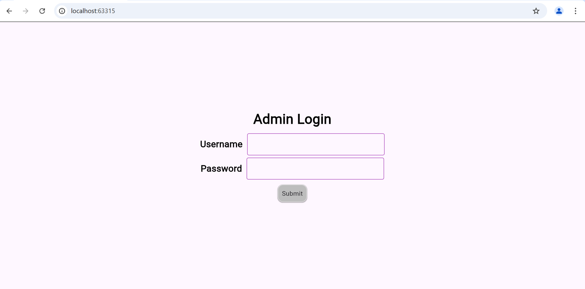

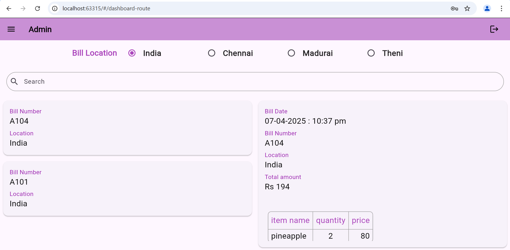
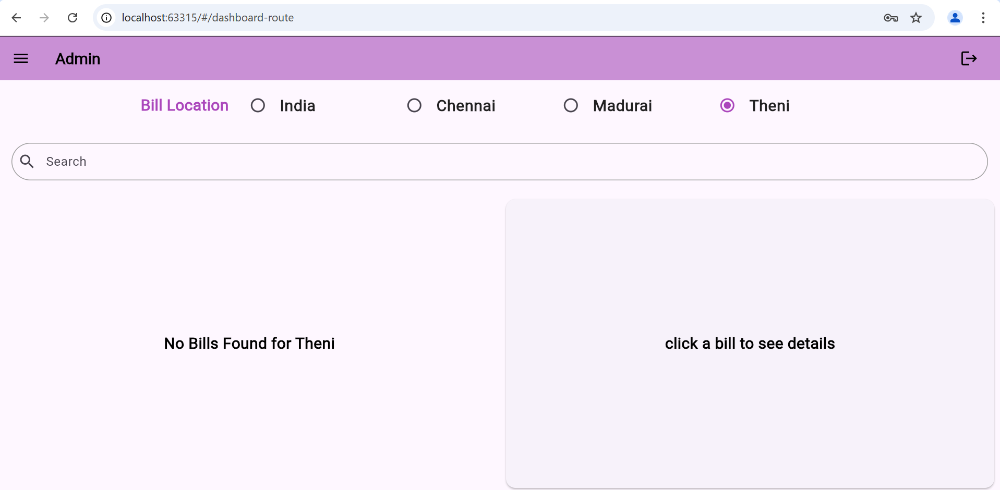
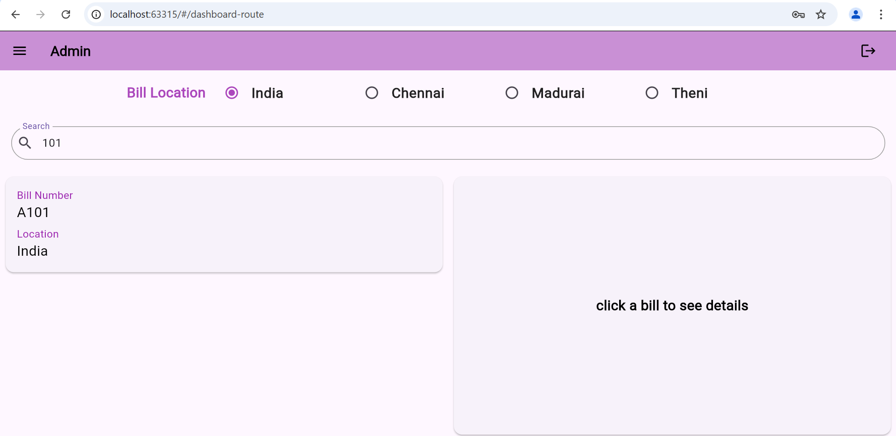
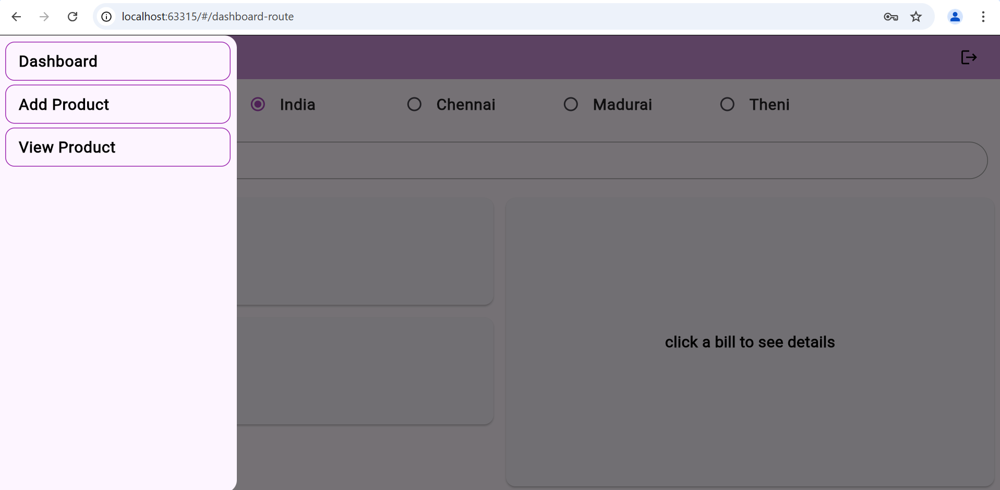
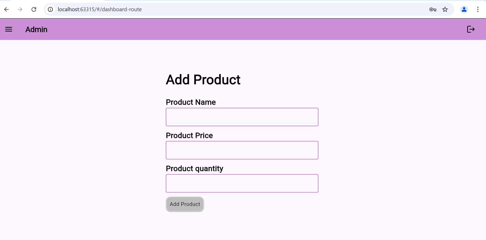
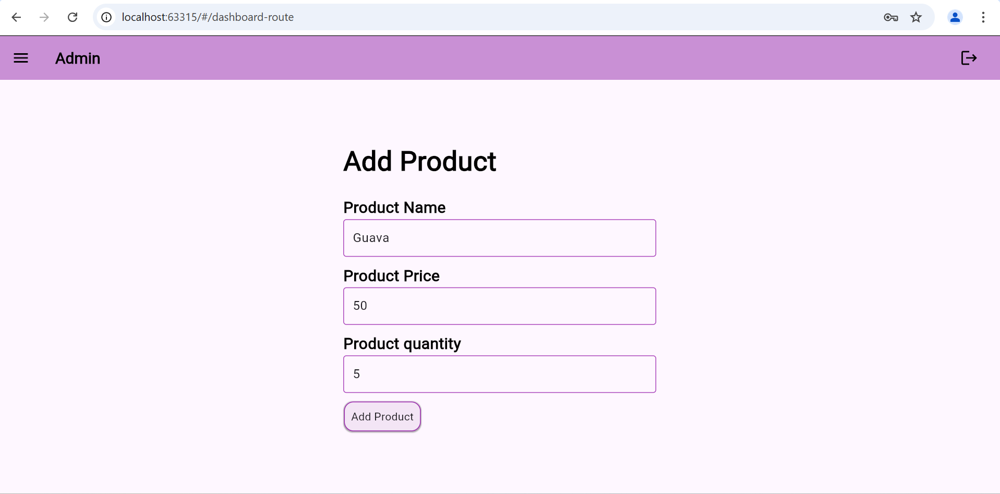
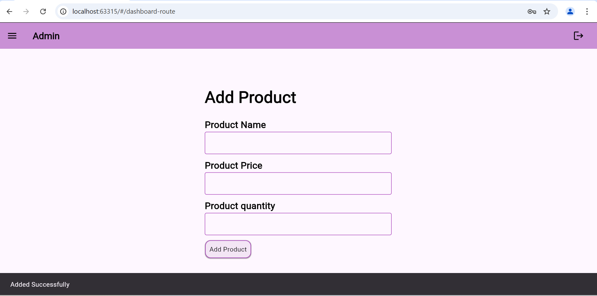
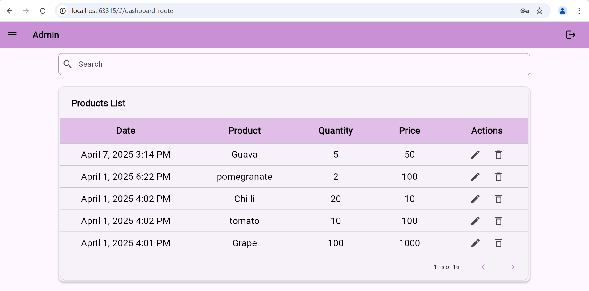
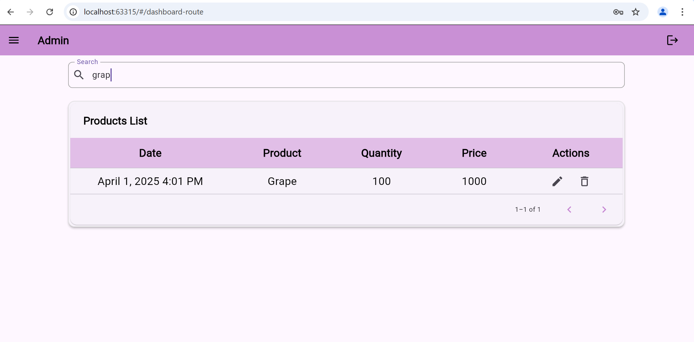
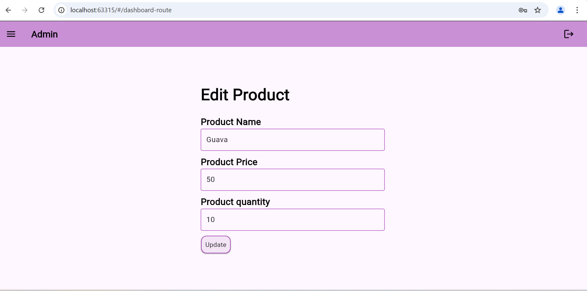
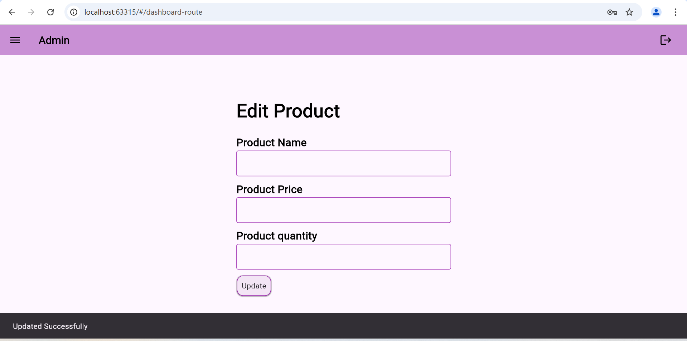
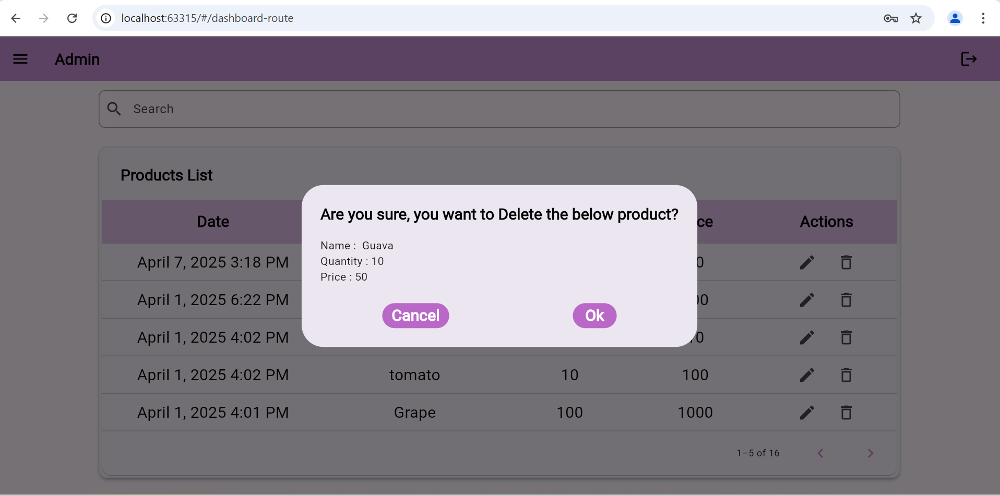
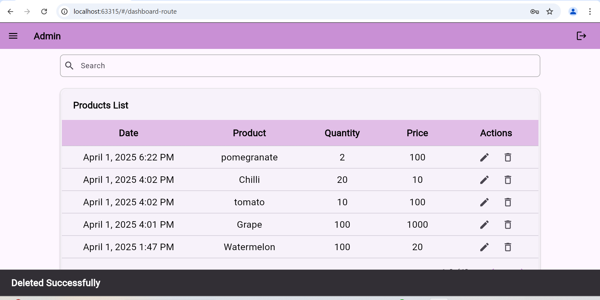

