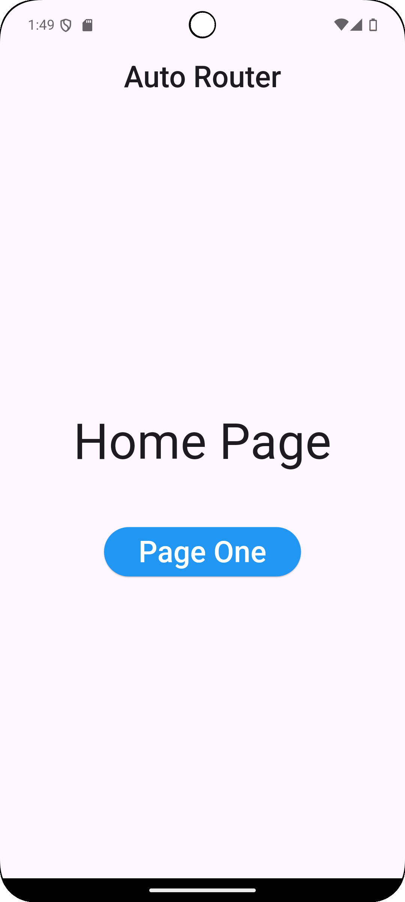

# navigation

This Project depicts the simple usage of Page Navigation using Auto_Router Package.  
It also used dev dependency auto_route_generator.  

# Navigation Flow

## HomePage
- **Button: "Page One"**
  - Navigates to **Page One**

## Page One
- **Button: "Home"**
  - Navigates to **HomePage**
- **Button: "Page Two"**
  - Navigates to **Page Two**

## Page Two
- **Button: "Page One"**
  - Navigates to **Page One** 

# ScreenShot

